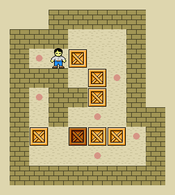

# Sokoban

## Spielregeln

- Der Spieler kann sich in vier Richtungen bewegen: nach oben, unten, links und rechts.
- Wenn der Spieler gegen eine Kiste stösst, kann er sie schieben.
- Kisten können nur geschoben werden, nicht gezogen.
- Der Spieler kann nicht mehrere Kisten gleichzeitig schieben.
- Das Ziel des Spiels ist es, alle Kisten auf die Zielfelder zu schieben.

## Beispiel Gameplay

